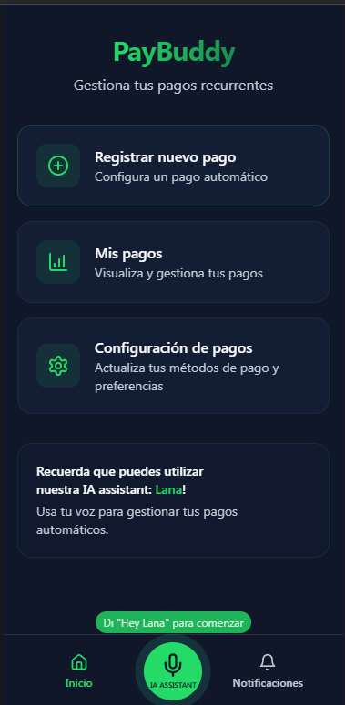

# High-Level-Design
## Entregable #2

### Diseño de Software
#### Alonso Durán Muñoz - 2023044780
#### Randy Baeza Ramírez - 2017047626

 
 

### Goal Map Diagram

 
 

### Estados que garantizan el éxito del sistema "Payment Assistant"

1. **UX positivo**: 
    La app debe contar con una interfaz intuitiva que permita a los usuarios explorar y configurar pagos automáticos sin complicaciones. Incluir tutoriales o indicaciones claras y accesibles facilitará el aprendizaje y la adopción de la herramienta tanto como para el uso de voz como de forma manual.

2. **Colaboración con Municipalidades y Organismos**: 
    Es importante que la aplicación establezca conexiones con municipalidades y organismos gubernamentales para facilitar el pago de impuestos y tasas locales. Esto no solo mejora la experiencia del usuario, sino que también promueve la adopción de la aplicación en el país.

3. **Conexión a Métodos de Pago Populares**: 
    La aplicación debe integrarse con métodos de pago populares en la región, así como con servicios de los principales bancos (BAC, Popular, BCR, etc.) y comercios locales (Walmart, Pricemart, FarmaValue, etc.). Facilitar transacciones con comercios grandes de alto trasito del público objetivo, promueve el uso de la app por conveniencia.

4. **Demostración de Valor**: 
    Es crucial mostrar a los usuarios y a las entidades involucradas cómo la aplicación puede mejorar la gestión de cobros y facilitar el proceso de pago. Esto puede ser mostrando estadísticas sobre la reducción de costos y esfuerzos, y el aumento de la eficiencia en la recaudación.

5. **Seguridad**: 
    Los usuarios deben estar seguros de que su información personal y de pago está protegida mediante medidas de seguridad robustas.

6. **Recordatorios Efectivos**: 
    La funcionalidad de recordatorios debe ser confiable y fácil de usar. Para que los usuarios confirmen pagos con un simple comando de voz o notificación ayudando a evitar fechas vencidas y multas, reduciendo el estrés financiero.

7. **Transparencia en las Transacciones**: 
    Los usuarios deben tener acceso a información clara y actualizada sobre el estado de sus transacciones y pagos recibidos, por medio de notificaciones. 

8. **Integración Efectiva**: 
    La capacidad de la aplicación para integrarse sin problemas con diferentes servicios de pago y organismos es vital (Como Simpe Móvil). Debe ofrecer beneficios claros para su adopción, como la facilidad de integración y la mejora en la experiencia del usuario.

 
 

### Wireframes

Se diseño la pantalla inicial y 2 pantallas necesarias para el proceso de registrar un nuevo pago automático. 
  

Los wireframes se hicieron a mano por medio de [Mockplus](https://www.mockplus.com/).

 

#### Pantalla Inicial

 

#### Registrar Nuevo Pago 1

 

#### Registrar Nuevo Pago 2

 
 

### Pantallas creadas por IA

 

Se utilizó [Lovable](https://lovable.dev/) para la creación de las pantallas.

 

#### Pantalla Inicial

 

#### Registrar Nuevo Pago 1

 

#### Registrar Nuevo Pago 2

 
 

### Test de usabilidad

 

Se utilizó [Maze](https://maze.co/) para realizar el test, usando un Figma de las capturas de las pantallas.
 
 
Personas que realizaron el test:

- Luz Ramírez: 58 años, Cajera - [Enlace a video evidencia](https://app.maze.co/report/reels/3d179955-2680-4151-a90d-7befad31a497)
- Didier Baeza: 61 años, Comerciante independiente - [Enlace a video evidencia](https://app.maze.co/report/reels/bf6198a5-7198-461b-a14f-26914ea35845)
- Diego Cortés: 25 años, Preparador de pinturas  - [Enlace a video evidencia](https://app.maze.co/report/reels/f02a45d1-c67f-4ca3-bd44-745afa2fb8d2)

 
 

#### Task: Haz click en el botón correspondiente para agregar un nuevo pago automático

 
 

#### Task: Haz click en el lugar correspondiente para seleccionar la fecha del pago

 
 

#### Task: Haz click en el lugar correspondiente para ingresar el monto del pago

 
 

#### Task: Haz click en el lugar correspondiente para ingresar el nombre del servicio a pagar

 
 

#### Task: Haz click en el lugar correspondiente para ver las notificaciones

 
 

#### Task: Haz click en el lugar correspondiente para seleccionar el método de pago

 
 

#### Task: Haz click en el botón para configurar los métodos de pago

 
 

#### Task: Haz click en el lugar correspondiente para seleccionar la frecuencia con la que se debe de realizar el pago

 
 

#### Task: Haz click en el botón correspondiente para conectarse con un servicio para obtener montos, cuentas y fechas de pago automáticamente

 
 

#### Task: Haz click en el botón correspondiente para ver los pagos registrados

 
 

#### Task: Haz click en el lugar correspondiente para ingresar el número de cuenta destino para realizar el pago

 
 

#### Task: Haz click en el botón correspondiente para seguir con el registro del pago, luego de ser ingresada la información solicitada

